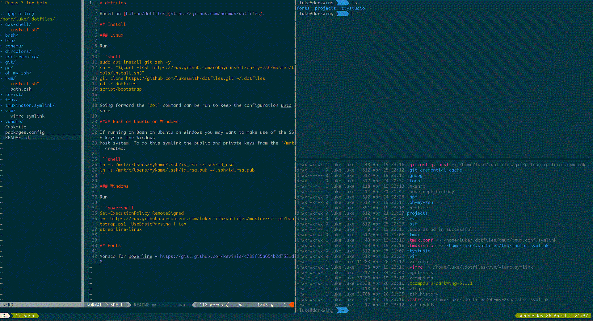

# dotfiles

Based on [holman/dotfiles](https://github.com/holman/dotfiles).



## Install

### Linux

Run

```shell
sudo apt install git zsh -y
sh -c "$(curl -fsSL https://raw.github.com/robbyrussell/oh-my-zsh/master/tools/install.sh)"
git clone https://github.com/lukesmith/dotfiles.git ~/.dotfiles
cd ~/.dotfiles
script/bootstrap
```

Going forward the `dot` command can be run to keep the configuration upto date

#### Bash on Ubuntu on Windows

If running on Bash on Ubuntu on Windows you may want to make use of the SSH keys on the Windows
host system. To do this symlink the public and private keys from the `/mnt` created:

```shell
ln -s /mnt/c/Users/MyName/.ssh/id_rsa ~/.ssh/id_rsa
ln -s /mnt/c/Users/MyName/.ssh/id_rsa.pub ~/.ssh/id_rsa.pub
```

### Windows

Run

```powershell
Set-ExecutionPolicy RemoteSigned
iwr https://raw.githubusercontent.com/lukesmith/dotfiles/master/script/bootstrap.ps1 -UseBasicParsing | iex
streamline-linux
```

## Fonts

Monaco for powerline - https://gist.github.com/kevinis/c788f85a654b2d7581d8

## Solarized Dark profile for Terminal.app on OSX

https://gist.github.com/matijs/808eda8c133d41f9338f89a0077d6b95